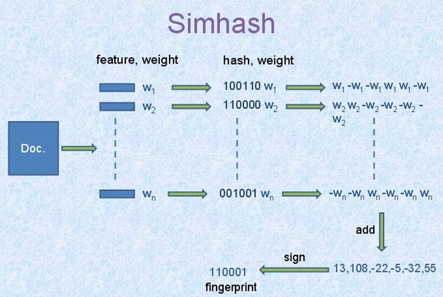

# 搜索引擎

项目依赖：JDK11（使用JDK自带的HttpClient）, JSoup(信息提取), slf4j, logback（日志记录）, jieba（分词工具），dom4j(XML 读取自定义配置), lucene(倒排索引)，MySql，maven。

搜索引擎由哪些模块组成呢？


图片摘自：https://www.ibm.com/developerworks/cn/java/j-lo-dyse1/index.html

## 下载模块

基本目标：从互联网上下载网页。

功能需求：下载稳定，下载快速。

下载稳定的意思是：防止目标网站一记绝杀（封IP）。

下载快速是说不要10秒才下载一个网页。

### 稳定下载（反反爬/微笑.JPG）

看见一张很经典的图：


图片摘自：http://www.cnblogs.com/zhaof/p/7326260.html

因为搜索引擎对于不是针对某个网站进行下载，所以上图的 cookie 和 账号这些都不用做。

需要做什么呢：

* 更换 User-agent
* 代理 IP
* 限制下载速度

如何实现代理 IP 池？

1. 代理IP网站，西刺提供免费代理IP，（https://www.xicidaili.com/）
2. 免费的虽然不要钱，但质量不好，所以我们需要筛选。
3. 筛选代理IP的网站可以找搜索引擎。
4. 注意筛选的速度喔，因为是单机环境，请求发太快了，本地处理不过来，容易误筛代理IP。
5. 保存IP(Redis 或应用缓存），如果代理IP数量多，就可以放在 Redis 里面。
6. 定时任务，每天抓取代理IP，重复之前步骤。

### 下载快速

怎么下载快，因为下载是IO任务，所以当然是多线程快啊！

多线程编程就是麻烦，编程之前需要想一个设计出来，这样才能写好代码。

通用搜索引擎下载设计图：


图片摘自：https://www.ibm.com/developerworks/cn/java/j-lo-dyse1/index.html

图片中的 Gather 是多例的，一个Gather 内部含有一组链接，Gather 就负责将这组链接对于的网页下载下来。

Gather 将网页下载下来之后呢？

将下载下来的网页保存到本地并交给 Extracter，Extracter 抽取网页中的链接，加入到 Dispather 链接分配器中。

Q：我们对一个网站频繁抓取是不是有点不道德呢？

A：Dispather 内部含有URL队列。我们根据站点划分多个子队列。按子队列抽取链接分配给Gather。这样就可以控制对单个网站的请求数量了啊，就不会出现对网站频繁请求的情况了。

Q：这就完了吗？

A：NO！我们还需要做一些善后工作。需要记录哪些URL已经下载过了，哪些URL过时了，防止重复请求浪费资源等一些细节工作。

Q：单机线程数量是有上限的啊！也不是很快嘛。

A：要不来分布式爬虫？NO。NIO 给了我们启示。我们可以让Gather 异步下载一组请求（结合 JDK11 HttpClient 和 CompletableFuture）。

## 分析模块


分析模块的输入就是下载系统下载的网页，经过分析后，输出的是：

* 网页 title, h1标签，h2 标签, h3 标签。
* meta 标签里的 keywords, description。
* 网页正文。

我们可以发现分析模块也是多IO操作可以做成多线程。

一边读取输入，一边分析，一边输出。可以借用生产者消费者模型，输入生产者积累输入提交分析，分析是输入的消费者和输出的生产者，输出是消费者。

### 网页正文分析

可以基于正文密度算法提取网页正文。核心思路就是去掉 html 标签以后，根据空行，空行间隔，空行间的文字进行打分，选取分数最高的作为正文。来举个栗子：

原始 html:

```
1<html>
2	<head>
3		<meta></meta>
4	</head>
5	<body>
6		<header>
7			<p>hello</>
8		<header>
9		<main>
10			<div>123456789</div>
11			<div>123456789</div>
12			<div>123456789</div>
13		</main>
14		<footer>
15			<p>版权</p>
16		</footer>
17	<body>
18 </html>
```

去除 html 标签后：

```

6
7                             hello
8
9
10                         123456789
11                         123456789
12                         123456789
13
14
15                       版权

```

那么中间的那块字比较多的， 就是我们要寻找的正文了。

虽然原理很简单，但是现实的网页复杂的多，这是一个调参的过程。

需要忽略一些字符数比较少的行，算做空行。一个空行阈值X，小于这个空行阈值的都被忽略。

以及空行的分数占比和字数分数占比等等参数。（10个空行之间的文字是正文的可能性大于5个空行之间的文字）

### 正文查重

因为互联网上存在大量转载文章，所以需要进行正文查重，防止用户搜索出来的结果全是相似或相同的文章。

google 以前使用的是 SimHash 算法，那我们也使用 Simhash 算法把。



图片摘自：http://yanyiwu.com/work/2014/01/30/simhash-shi-xian-xiang-jie.html

大体思路就是：

1. 提取*特征词*，给这个特征池一个权值W。
2. 进行 hash 计算，hash 得到的二进制串。
3. 二进制串中的1为W，0为-W，将每个特征词对于的二进制串进行累加。
4. 然后将结果中数大于 0 的映射为 1， 小于0 的映射为 0，
5. 如上 13，108，-22，-5，-32，55 就为 1,1,0,0,0,1

## 展示

下载模块运行示例，下载时间（约1s），可扩大，即增多Dispather中URL队列:


首页：

'

搜索结果：


